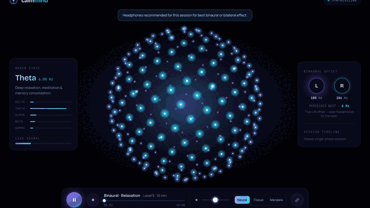

# CalmMind

**Audiotistic application** — browser-based relaxation audio with procedural, audio-reactive canvas visualizers.

<p align="center">
  
</p>

<p align="center">
  <em>Screen recording of the live app (Binaural · Relaxation, Neural Bloom) — not a mockup</em>
</p>

<p align="center">
  <a href="https://github.com/v3gaS/Calm-Mind/actions/workflows/test.yml"></a>
</p>

---

## Important notices

| Topic | Details |
|-------|---------|
| **Creator** | **John Valachovic** — [JValachovic@gmail.com](mailto:JValachovic@gmail.com) |
| **License** | **All rights reserved.** Use requires **express written permission**. See [LICENSE](LICENSE). |
| **Wellness only** | **Not a medical device.** Not clinical EMDR, diagnosis, or emergency care. See [DISCLAIMER](DISCLAIMER.md). |
| **Research** | Background notes in [`docs/research/`](docs/research/) are **informational**; they do not prove efficacy of this build. See [docs/research/README.md](docs/research/README.md). |
| **Privacy** | No account system; session prefs use **local `localStorage` only**. See [PRIVACY.md](PRIVACY.md). |
| **Security** | Do not commit secrets or health data. See [SECURITY.md](SECURITY.md). |

> **Headphones** are recommended for binaural and bilateral presets. Use comfortable volume. Stop if you feel unwell.

---

## Features

- **Web Audio engine** — binaural beats, isochronic tones, pink noise, solfeggio-style tones, HRV-paced modulation, bilateral (BLS) alternation, ambient loops
- **Evidence-tagged protocols** — Anxiety Reset, Sleep Onset, Focus Sprint, Coherence Breath, Calm Down (BLS), plus custom sessions ([`client/js/protocols.js`](client/js/protocols.js))
- **CC0 nature ambients** — rain, ocean, forest variants ([`assets/audio/ATTRIBUTION.md`](assets/audio/ATTRIBUTION.md))
- **Canvas visualizers** — Neural Bloom, Living Tissue, Mandala; **audio-reactive while playing** ([`docs/subsystems/visualization.md`](docs/subsystems/visualization.md))
- **Claude Design UI** — primary entry [`index.html`](index.html); legacy Three.js UI at [`index-legacy.html`](index-legacy.html)
- **112 Jest tests** on modular [`src/`](src/) audio and visualization helpers

---

## Quick start

**Requirements:** Node.js 18+, modern browser, **HTTP** (not `file://`).

```bash
git clone https://github.com/v3gaS/Calm-Mind.git
cd Calm-Mind
npm install
npm run launch
```

`npm run launch` picks a free port (3000–3099), serves the repo root, and opens the browser.

| Command | Description |
|---------|-------------|
| `npm run dev` / `npm start` | Static server only |
| `npm test` | Jest unit tests |
| `npm run test:watch` | Jest watch mode |
| `npm run test:coverage` | Coverage report |

**macOS:** double-click [`CalmMind.command`](CalmMind.command).

**Legacy UI:** `http://127.0.0.1:<port>/index-legacy.html`

---

## Promotion assets

| Asset | Use |
|-------|-----|
| [`assets/promo/calmmind-promo.gif`](assets/promo/calmmind-promo.gif) | README hero — real app screen capture |
| [`assets/branding/CalmMind_Logo.jpg`](assets/branding/CalmMind_Logo.jpg) | Top-left brand on `index.html` |

Regenerate after UI changes:

```bash
npm run dev   # in another terminal
node scripts/capture-app-promo.mjs
```

---

## Architecture (short)

| Layer | Location |
|-------|----------|
| Primary UI | [`index.html`](index.html), [`client/css/design.css`](client/css/design.css), [`client/js/design-*.js`](client/js/) |
| Audio (shipped) | [`client/js/audio.js`](client/js/audio.js) |
| Visuals (shipped) | [`client/js/calm-viz.js`](client/js/calm-viz.js) → `#viz` |
| Modular (Jest) | [`src/`](src/) — not the primary browser runtime |
| Docs | [`docs/README.md`](docs/README.md) |

```text
masterGain → AnalyserNode → CalmMindAudioReactive → CalmMind.frame → CalmViz (canvas)
```

---

## Directory layout

```text
.
├── index.html, index-legacy.html
├── client/js/              # Shipped browser modules
├── assets/
│   ├── audio/ambient/      # CC0 .ogg loops
│   ├── branding/           # CalmMind_Logo.jpg, Logo.png (legacy)
│   └── promo/              # calmmind-promo.gif (README)
├── lib/static-server.cjs
├── src/                    # ES modules (Jest)
├── tests/
├── archive/                # Unwired / superseded code
└── docs/                   # Canonical documentation
```

**Publishing to GitHub:** pre-push checklist, do-not-commit list, and CI expectations — [docs/guides/github-publication.md](docs/guides/github-publication.md).

---

## Research & protocols

- **Protocol presets** ship in [`client/js/protocols.js`](client/js/protocols.js). `evidence` fields describe **design intent** (e.g. published frequency bands), not guaranteed outcomes.
- **Research folder** [`docs/research/`](docs/research/) — literature summaries; **not** peer review of this app. Read [docs/research/README.md](docs/research/README.md) before citing clinically.
- **Therapy-oriented guide** (safety, headphones, visualization): [docs/guides/therapy.md](docs/guides/therapy.md)

---

## Documentation

| Doc | Purpose |
|-----|---------|
| [docs/README.md](docs/README.md) | Task router for contributors & agents |
| [docs/integration/frontend-reference.md](docs/integration/frontend-reference.md) | Engine `window.*` contract |
| [docs/integration/claude-design-alignment.md](docs/integration/claude-design-alignment.md) | Primary UI handoff |
| [docs/subsystems/visualization.md](docs/subsystems/visualization.md) | Canvas viz + audio reactivity |
| [docs/guides/development.md](docs/guides/development.md) | Conventions |
| [AGENTS.md](AGENTS.md) | Cursor / agent instructions |
| [docs/guides/github-publication.md](docs/guides/github-publication.md) | Pre-push / GitHub upload checklist |

---

## Contributing

Contributions require **compatibility with the proprietary license** and maintainer approval. See [CONTRIBUTING.md](CONTRIBUTING.md).

1. Confirm permission scope with the copyright holder if you are not John Valachovic.
2. Fork, branch, `npm test`, smoke-test with `npm run launch`.
3. Update canonical docs when changing shipped behavior.

---

## GitHub repository files

| File | Purpose |
|------|---------|
| [LICENSE](LICENSE) | Proprietary — express permission required |
| [AUTHORS.md](AUTHORS.md) | Creator attribution |
| [NOTICE.md](NOTICE.md) | Third-party licenses & attributions |
| [DISCLAIMER.md](DISCLAIMER.md) | Wellness / liability |
| [SECURITY.md](SECURITY.md) | Vulnerability reporting |
| [PRIVACY.md](PRIVACY.md) | Data handling |
| [CODE_OF_CONDUCT.md](CODE_OF_CONDUCT.md) | Community standards |
| [.github/](.github/) | Issue templates & CI |

---

## License

**© 2026 John Valachovic. All rights reserved.**

No use, reproduction, or distribution without **express written permission**.  
Permission requests: [JValachovic@gmail.com](mailto:JValachovic@gmail.com) — see [LICENSE](LICENSE) and [AUTHORS.md](AUTHORS.md).

Third-party components (Jest, Three.js, CC0 audio, etc.) are listed in [NOTICE.md](NOTICE.md).
